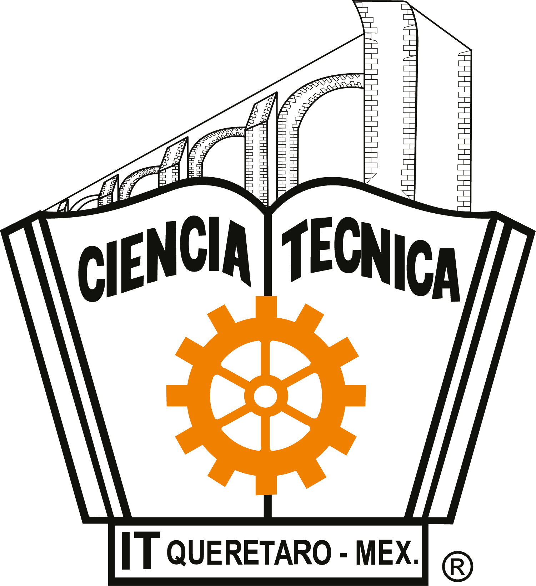

# Instituto Tecnológico de Querétaro

El presente repositorio contiene toda la información que se proporciona en la materia "Arquitectura de despliegue de alta disponibilidad".

---

La asignatura aborda el diseño y operación de arquitecturas de alta disponibilidad, escalables y tolerantes a fallos para sistemas basados en microservicios. Incluye la comprensión y uso de orquestadores como Kubernetes, redes de servicio, balanceo de carga, escalamiento automático, despliegue continuo, infraestructura como código, monitoreoavanzado y despliegue en la nube.

Aporta al perfil del estudiante habilidades para operar sistemas productivos modernos, esenciales para roles de DevOps, SRE (Site Reliability Engineer), arquitecto de software y especialista en infraestructura cloud.
