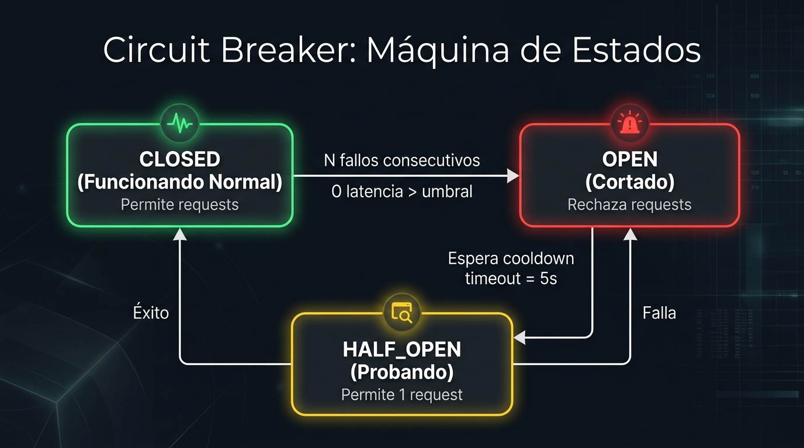
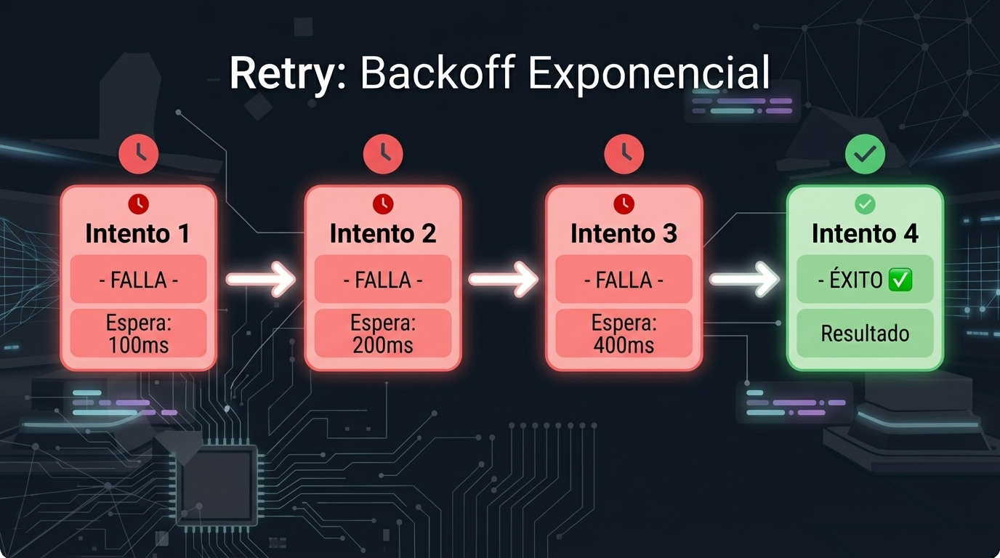
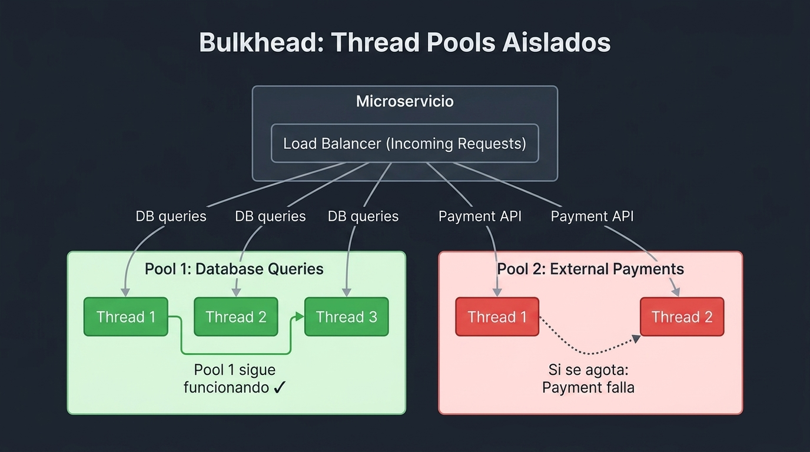
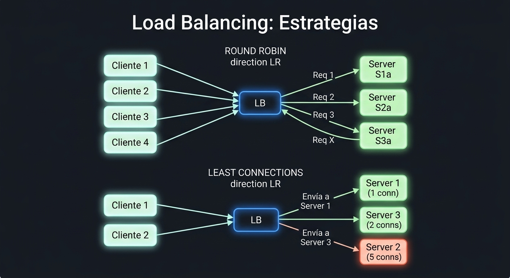

# 1.2 Patrones de Diseño para la Resiliencia y la Distribución

En la sesión anterior analizamos cómo cuantificar la confiabilidad mediante métricas como SLI y SLO e identificar los puntos únicos de fallo, y ahora en esta sesión llevaremos ese conocimiento a la práctica al explorar patrones de diseño como _circuit breaker_, _bulkhead_ y _rate limiting_ para aislar y tolerar fallas de forma arquitectónica.

## 1. Explicación conceptual

En una arquitectura basada en microservicios, la red no es confiable. A medida que escalamos un sistema distribuido, la probabilidad de que uno o más nodos experimenten latencia, pérdida de paquetes o fallas totales se acerca al 100%. Si un servicio falla sin mecanismos de protección, esa degradación puede propagarse rápidamente a través de llamadas síncronas en cadena, provocando un colapso generalizado (_cascading failure_).

Para evitar que una falla local destruya el sistema completo, implementamos dos pilares de patrones arquitectónicos: **patrones de resiliencia** (aislamiento y tolerancia a fallas en ejecución) y **patrones de distribución y replicación** (gestión de datos y tráfico en entornos altamente distribuidos).

### Patrones de resiliencia

- **Circuit breaker:** Actúa como un interruptor eléctrico de seguridad. Supervisa las llamadas a un servicio externo o dependiente. Si la tasa de errores o la latencia supera un umbral definido, el circuito se abre (_open state_), cortando inmediatamente las llamadas posteriores y devolviendo una respuesta rápida de error o un _fallback_. Después de un período de enfriamiento (_cooldown_), pasa a un estado semi-abierto (_half-open_) para probar si el servicio remoto se ha recuperado.

#### Circuit Breaker: Máquina de Estados



- **Retry con _exponential backoff_ y _jitter_:** Reintenta operaciones fallidas de forma automática. Para no saturar un servicio que apenas se está recuperando de una caída (_retry storm_), se aplica un tiempo de espera exponencial entre reintentos (_exponential backoff_) sumado a un factor aleatorio (_jitter_) que desincroniza las peticiones concurrentes.

#### Retry: Backoff Exponencial



- **Rate limiting:** Limita la cantidad de peticiones que un cliente o microservicio puede realizar en una ventana de tiempo específica. Protege la infraestructura contra picos de tráfico inesperados, ataques de denegación de servicio (_DoS_) y garantiza un consumo justo de recursos.

- **Bulkhead:** Inspirado en los mamparos estancos de los barcos. Divide los recursos del sistema (como _thread pools_ o _connection pools_) en compartimentos aislados. Si un _pool_ de hilos se agota por culpa de una base de datos lenta, los demás microservicios o hilos continúan operando con normalidad.

#### Bulkhead: Thread Pools Aislados



- **Fallback:** Proporciona una ruta alternativa de degradación elegante (_graceful degradation_) cuando falla la llamada principal (por ejemplo, devolver datos guardados en caché o un valor por defecto seguro).

### Patrones de distribución y replicación de datos

- **CQRS (_Command Query Responsibility Segregation_):** Separa las operaciones de escritura/modificación (_commands_) de las operaciones de lectura (_queries_). Esto permite escalar la infraestructura de lectura e infraestructura de escritura de forma independiente según el perfil de carga.

- **Event sourcing:** En lugar de almacenar únicamente el estado actual de un objeto en la base de datos, se almacena una secuencia inmutable de eventos de dominio (_append-only log_). El estado actual se reconstruye reejecutando dichos eventos.

- **Saga pattern:** Gestiona transacciones distribuidas a través de múltiples microservicios mediante una secuencia de transacciones locales. Cada paso actualiza la base de datos de un servicio y emite un evento/mensaje para desencadenar el siguiente paso. Si un paso falla, la saga ejecuta transacciones compensatorias (_compensating transactions_) para revertir los cambios realizados.

- **Replicación lectura/escritura:** Divide la base de datos en un nodo primario (_leader/primary_) enfocado en escrituras y múltiples réplicas de lectura (_read replicas/followers_). La sincronización entre el nodo primario y las réplicas suele ser asíncrona, lo que introduce el concepto de consistencia eventual (_eventual consistency_).

### Balanceo de carga y distribución de tráfico

El _load balancing_ es fundamental para distribuir las solicitudes entre múltiples instancias saludables de un microservicio. Se puede ejecutar en el lado del servidor (_server-side load balancing_ mediante componentes como un _Ingress Controller_ o un _Load Balancer_ de nube) o en el lado del cliente (_client-side load balancing_ como el integrado en arquitecturas de _service mesh_ mediante proxies como Envoy), aplicando algoritmos como _Round Robin_, _Least Connections_ o _IP Hash_.

#### Load Balancing: Estrategias



## 2. Analogía del mundo real

Imagina la estructura y operación de un crucero transatlántico en alta mar:

- **Bulkhead:** El casco del barco está dividido internamente por muros de acero herméticos (_bulkheads_). Si una vía de agua perfora el casco en el área de carga, el agua se contiene únicamente en esa sección. El resto de las habitaciones y el motor permanecen secos y el barco sigue navegando sin hundirse.

- **Circuit breaker:** Es igual a los fusibles principales de la sala de máquinas. Si el sistema de iluminación de los camarotes sufre un cortocircuito por sobrecarga, el fusible "salta" de inmediato para cortar el flujo de corriente en ese tramo específico, evitando que se incendie el generador principal que alimenta el timón del barco.

- **Rate limiting:** Es el control de acceso en la entrada del restaurante buffet del crucero. Si 500 pasajeros intentan entrar exactamente al mismo tiempo a las 2:00 PM, el personal de puerta permite el acceso únicamente a 30 personas por minuto. Los demás esperan ordenadamente en la fila para que la cocina no colapse por sobredemanda.

- **Fallback:** Si se interrumpe la señal del satélite para ver televisión por cable en vivo en las suites, el sistema activa automáticamente una transmisión de películas almacenadas previamente en el servidor local del barco. El usuario nota la ausencia de canales en vivo, pero sigue teniendo entretenimiento disponible.

## 3. Desglose técnico paso a paso

Implementaremos patrones de resiliencia (_Circuit Breaker_, _Retry_, _Timeout_, _Fallback_ y _Bulkhead_) en una aplicación **Quarkus** utilizando las especificaciones de **SmallRye Fault Tolerance** (MicroProfile Fault Tolerance).

### Paso 1: Agregar las dependencias al proyecto

Asegúrate de incluir la extensión de tolerancia a fallos en el archivo `pom.xml` de tu proyecto Quarkus:

```xml
<dependencies>
    <!-- Extensión para servicios REST con RESTEasy Reactive -->
    <dependency>
        <groupId>io.quarkus</groupId>
        <artifactId>quarkus-resteasy-reactive-jackson</artifactId>
    </dependency>
    <!-- Extensión SmallRye Fault Tolerance -->
    <dependency>
        <groupId>io.quarkus</groupId>
        <artifactId>quarkus-smallrye-fault-tolerance</artifactId>
    </dependency>
</dependencies>
```

### Paso 2: Crear un cliente o servicio dependiente con fallas simuladas

Crearemos un servicio que simule la comunicación con un sistema externo inestable (por ejemplo, una pasarela de pagos externa).

Crea el archivo `src/main/java/org/acme/resilience/ExternalPaymentService.java`:

```java
package org.acme.resilience;

import jakarta.enterprise.context.ApplicationScoped;
import java.util.Random;

@ApplicationScoped
public class ExternalPaymentService {

    private final Random random = new Random();

    public String processPayment(String transactionId) throws Exception {
        // Simular latencia o falla aleatoria
        int chance = random.nextInt(10);
        
        if (chance < 6) { // 60% de probabilidad de falla
            throw new RuntimeException("External payment gateway timeout/unreachable");
        } else if (chance == 6 || chance == 7) { // 20% de probabilidad de respuesta lenta
            Thread.sleep(3000); 
        }

        return "PAYMENT_SUCCESS_" + transactionId;
    }
}
```

### Paso 3: Aplicar anotaciones de resiliencia en el recurso REST

Aplicaremos los patrones _@CircuitBreaker_, _@Retry_, _@Timeout_, _@Bulkhead_ y _@Fallback_ para proteger el punto de entrada de nuestro microservicio.

Crea el archivo `src/main/java/org/acme/resilience/PaymentResource.java`:

```java
package org.acme.resilience;

import org.eclipse.microprofile.faulttolerance.Bulkhead;
import org.eclipse.microprofile.faulttolerance.CircuitBreaker;
import org.eclipse.microprofile.faulttolerance.Fallback;
import org.eclipse.microprofile.faulttolerance.Retry;
import org.eclipse.microprofile.faulttolerance.Timeout;
import jakarta.inject.Inject;
import jakarta.ws.rs.GET;
import jakarta.ws.rs.Path;
import jakarta.ws.rs.PathParam;
import jakarta.ws.rs.Produces;
import jakarta.ws.rs.core.MediaType;
import java.time.temporal.ChronoUnit;

@Path("/v1/payments")
public class PaymentResource {

    @Inject
    ExternalPaymentService paymentService;

    @GET
    @Path("/{id}")
    @Produces(MediaType.APPLICATION_JSON)
    // 1. TIMEOUT: Si la llamada tarda más de 1000ms, lanza TimeoutException
    @Timeout(value = 1000, unit = ChronoUnit.MILLIS)
    // 2. RETRY: Reintenta hasta 3 veces con un retraso inicial de 200ms y jitter
    @Retry(maxRetries = 3, delay = 200, jitter = 100)
    // 3. CIRCUIT BREAKER: Si el 50% de las últimas 4 peticiones fallan, abre el circuito por 5 segundos
    @CircuitBreaker(requestVolumeThreshold = 4, failureRatio = 0.5, delay = 5000)
    // 4. BULKHEAD: Permite un máximo de 5 ejecuciones concurrentes en este método
    @Bulkhead(value = 5)
    // 5. FALLBACK: Si todo lo demás falla o el circuito está abierto, ejecuta este método de respaldo
    @Fallback(fallbackMethod = "fallbackPaymentResponse")
    public String checkout(@PathParam("id") String id) throws Exception {
        return paymentService.processPayment(id);
    }

    // Método de Fallback (debe tener la misma firma que el método original)
    public String fallbackPaymentResponse(String id) {
        return "{\"status\": \"DEGRADED\", \"message\": \"Payment queued for asynchronous processing\", \"transaction_id\": \"" + id + "\"}";
    }
}
```

### Paso 4: Ajustar la configuración global de resiliencia

Podemos sobreescribir o ajustar los valores de tolerancia a fallos directamente en el archivo `src/main/resources/application.properties` sin necesidad de recompilar el código Java:

```properties
# Habilitar o deshabilitar la tolerancia a fallos globalmente (útil para pruebas)
smallrye.faulttolerance.enabled=true

# Sobreescribir parámetros del Circuit Breaker para una clase o método específico
org.acme.resilience.PaymentResource/checkout/CircuitBreaker/delay=8000
org.acme.resilience.PaymentResource/checkout/CircuitBreaker/requestVolumeThreshold=6

```

### Paso 5: Verificación y pruebas de estrés

1. Inicia la aplicación Quarkus en modo desarrollo:

    ```bash
    ./mvnw quarkus:dev
    ```

2. Ejecuta un script en la terminal para lanzar múltiples peticiones consecutivas y observar cómo el _Circuit Breaker_ cambia de estado y activa el _Fallback_:

    ```bash
    for i in {1..15}; do 
      echo -n "Request $i: "; 
      curl -s http://localhost:8080/v1/payments/TX-$i; 
      echo ""; 
      sleep 0.2; 
    done
    ```

3. Observa los logs en la consola: cuando el número de fallas simula la apertura del circuito, las peticiones siguientes devolverán la respuesta del método `fallbackPaymentResponse` instantáneamente sin intentar llamar a `ExternalPaymentService`.

4. Identifica manualmente en qué momento comienza la degradación controlada y qué patrón la está conteniendo (`Retry`, `CircuitBreaker`, `Bulkhead` o `Fallback`).

## 4. Reto de ingeniería o pregunta de reflexión

**El escenario:** Un microservicio de inventario tiene configurado un patrón _@Retry_ con `maxRetries = 5` sin ningún tipo de _delay_ o _jitter_, combinado con un _Circuit Breaker_ configurado con un umbral de falla del `50%` sobre una ventana de `10` peticiones.

Durante una venta nocturna de alto tráfico, la base de datos relacional subyacente del servicio de inventario comienza a experimentar una alta latencia de disco (I/O) debido a la saturación de lecturas.

**Para debatir en clase:**

1. ¿Por qué la combinación actual de ese _@Retry_ agresivo junto al _Circuit Breaker_ empeorará la caída de la base de datos en lugar de protegerla?

2. Si aplicamos la arquitectura de patrón **Saga** para procesar una compra que involucra tres microservicios (_Ordenes_, _Pagos_ e _Inventario_), ¿qué sucede si la transacción falla en el último paso (_Inventario_)? Explica el flujo de las transacciones compensatorias y cómo se garantiza la consistencia eventual entre los servicios.
