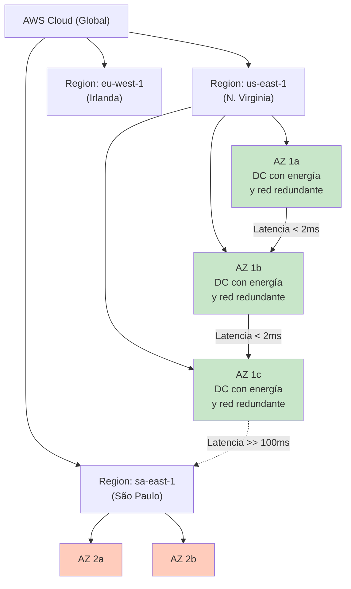
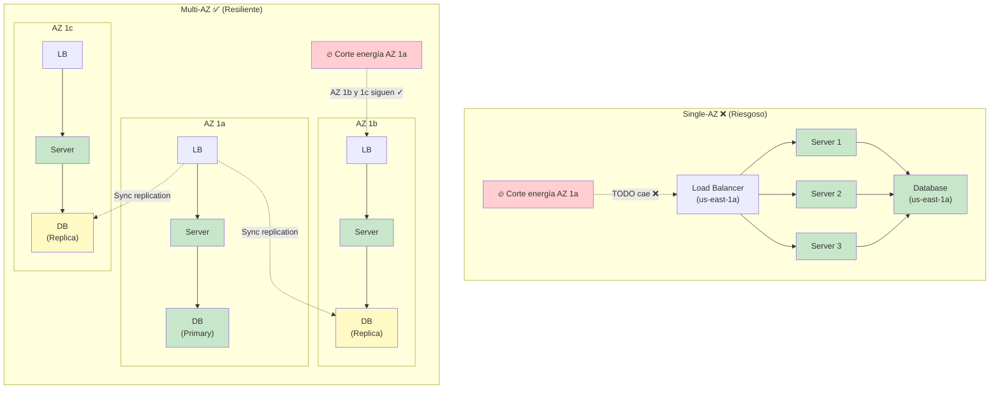
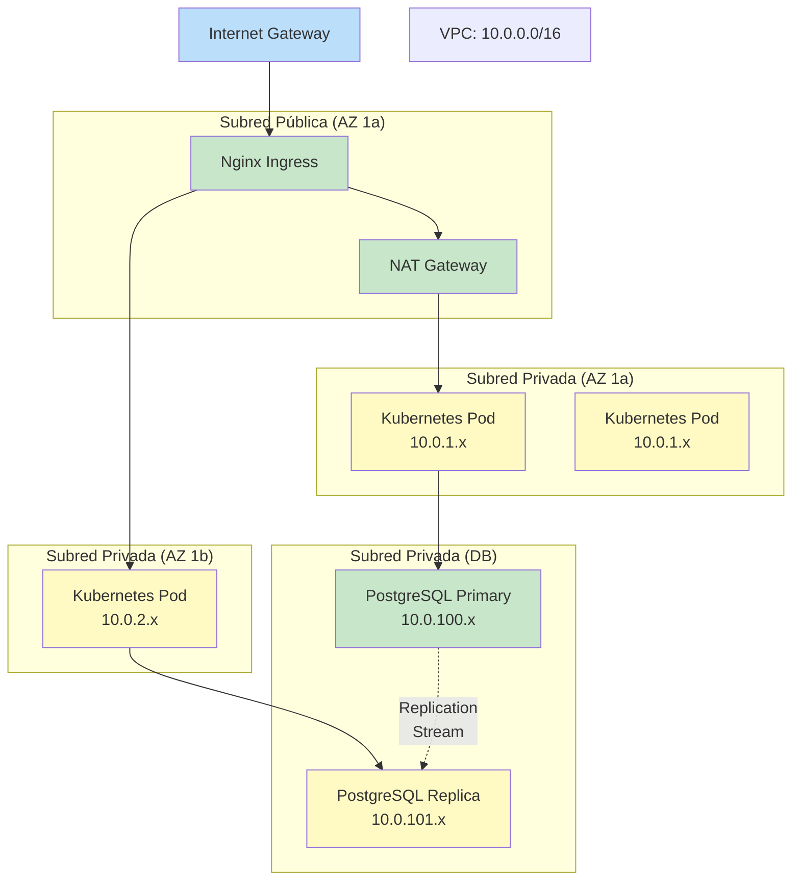
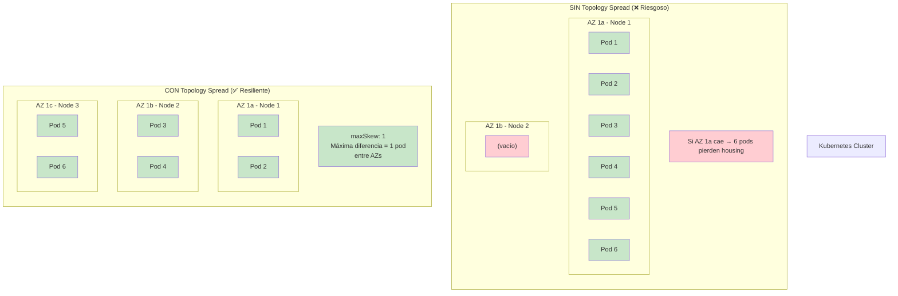

# 1.3 Despliegue en la Nube y Zonas de Disponibilidad

En la sesión anterior analizamos cómo implementar patrones de resiliencia como _circuit breaker_ y _bulkhead_ a nivel de aplicación, y ahora en esta sesión llevaremos ese conocimiento a la práctica al explorar la infraestructura _multi-AZ_ y arquitecturas tolerantes a fallos en la nube.

### 1. Explicación conceptual

Aunque escribamos el código más resiliente del mundo con _circuit breakers_ y reintentos, si el centro de datos físico donde corre nuestro código sufre un corte de energía, una inundación o la fibra óptica principal se rompe, la aplicación caerá por completo. Por eso, en el entorno _cloud-native_, la alta disponibilidad a nivel de software debe complementarse obligatoriamente con la **alta disponibilidad a nivel de infraestructura y red**.

#### Regiones y zonas de disponibilidad (_Availability Zones_ - AZs)

Los proveedores de nube pública estructuran su infraestructura global en tres niveles jerárquicos:

- **Región (_Region_):** Un área geográfica aislada en el mundo (por ejemplo, `us-east-1` en N. Virginia o `sa-east-1` en São Paulo). Cada región está completamente aislada de las demás para garantizar contención de fallas catastróficas.

- **Zona de disponibilidad (_Availability Zone_ - AZ):** Uno o más _data centers_ físicos discretos situados dentro de una misma región. Cada AZ cuenta con alimentación eléctrica redundante, sistemas de enfriamiento independientes y conectividad de red dedicada. Las AZs dentro de una misma región están interconectadas mediante redes de fibra óptica de ultra baja latencia (<2 ms).

- **Ubicaciones de borde (_Edge Locations_ / Point of Presence - PoP):** Puntos de presencia distribuidos globalmente para redes de entrega de contenido (_CDN_) y _caching_ de baja latencia cerca del usuario final.

#### Jerarquía: Región → AZs → Data Centers



#### Estrategias de despliegue: Multi-AZ vs. Multi-Región

1. **Despliegue single-AZ:** Todas las instancias del microservicio y la base de datos corren en una sola AZ. Es económico y simple, pero presenta un riesgo altísimo: si esa AZ falla, el sistema colapsa (crea un _Single Point of Failure_).

2. **Despliegue multi-AZ:** Las instancias del microservicio y las réplicas de base de datos se distribuyen entre al menos dos o tres AZs de la misma región. Un _load balancer_ público o privado distribuye el tráfico entre zonas. Si una AZ física se desconecta, las demás absorben la carga sin interrupción del servicio.

3. **Despliegue multi-región:** La arquitectura se replica en dos o más regiones geográficas distantes. Ofrece tolerancia a desastres a nivel continental (_Disaster Recovery_ - DR), pero introduce complejidad técnica en la replicación de bases de datos debido a la latencia de red entre regiones y los costos de transferencia de datos (_data egress_).

#### Single-AZ vs. Multi-AZ Comparación Visual



#### Componentes clave a nivel de red e infraestructura Cloud-Native

- **VPC (_Virtual Private Cloud_) y subredes:** División lógica de la red en subredes públicas (para los _load balancers_ e _ingress controllers_) y subredes privadas (para los trabajadores de Kubernetes y bases de datos).

- **Topology Spread Constraints:** En Kubernetes, son reglas que obligan al orquestador a distribuir los _Pods_ equitativamente entre los diferentes nodos y AZs del clúster (utilizando la etiqueta estándar `topology.kubernetes.io/zone`).

- **Global Server Load Balancing (GSLB) / DNS Routing:** Mecanismos como AWS Route 53 o Cloudflare que usan _health checks_ para redirigir el tráfico del usuario a la región o AZ más cercana y saludable.

#### VPC y Subredes



### 2. Analogía del mundo real

Imagina que administras la logística de entregas de una importante cadena de farmacias durante una época de emergencias de salud:

- **Single-AZ:** Guardas todo tu inventario de medicinas en un único almacén ubicado en el norte de la ciudad. Si se produce una inundación que bloquea ese almacén, ninguna farmacia puede recibir medicamentos y toda la operación se paraliza.

- **Multi-AZ:** Divides tu inventario en tres almacenes independientes ubicados en el norte, centro y sur de la ciudad, interconectados por una autopista exprés. Si el almacén del norte sufre un corte de energía, los camiones de reparto son redirigidos automáticamente a los almacenes del centro y sur. La entrega continúa sin interrupciones para el cliente.

- **Multi-Región:** Tienes centros de distribución masivos tanto en la Ciudad de México como en Monterrey. Si ocurre un terremoto o huracán que inhabilita por completo las comunicaciones en el centro del país, la sede de Monterrey toma el control y sigue enviando medicamentos al resto de las ciudades.

### 3. Desglose técnico paso a paso

Para garantizar que nuestros microservicios distribuidos toleren la caída completa de un _data center_ o AZ en producción, utilizaremos reglas de **Topology Spread Constraints** en un manifiesto de Kubernetes (_Deployment_) para forzar la alta disponibilidad a nivel de infraestructura.

#### Prerrequisitos de la infraestructura cloud

Un clúster de Kubernetes en la nube (como EKS, GKE, AKS u OKE) donde los nodos (_Worker Nodes_) están etiquetados automáticamente por el proveedor según su AZ: `topology.kubernetes.io/zone=us-east-1a` `topology.kubernetes.io/zone=us-east-1b` `topology.kubernetes.io/zone=us-east-1c`

#### Paso 1: Definir el archivo de configuración del Deployment (`deployment-multi-az.yaml`)

Crea un archivo llamado `deployment-multi-az.yaml` con la definición de un microservicio de Quarkus configurado para alta disponibilidad multi-zona:

```yaml
apiVersion: apps/v1
kind: Deployment
metadata:
  name: order-service-ha
  namespace: production
  labels:
    app.kubernetes.io/name: order-service
    app.kubernetes.io/part-of: e-commerce-platform
spec:
  replicas: 6
  selector:
    matchLabels:
      app: order-service
  template:
    metadata:
      labels:
        app: order-service
    spec:
      # Restricción de distribución topológica entre AZs
      topologySpreadConstraints:
        - maxSkew: 1
          topologyKey: topology.kubernetes.io/zone
          whenUnsatisfiable: DoNotSchedule
          labelSelector:
            matchLabels:
              app: order-service
        # Restricción secundaria: Evitar poner múltiples Pods en el mismo Nodo
        - maxSkew: 1
          topologyKey: kubernetes.io/hostname
          whenUnsatisfiable: ScheduleAnyway
          labelSelector:
            matchLabels:
              app: order-service

#### Topology Spread Constraints: Distribución de Pods



El parámetro `maxSkew: 1` significa que la diferencia máxima de pods distribuidos entre AZs es de 1. Por ejemplo, si tenemos 6 replicas, cada AZ tendrá exactamente 2 pods. Si tenemos 7 replicas, dos AZs tendrán 2 pods y una AZ tendrá 3 pods (diferencia máxima = 1).

      containers:
        - name: order-service-container
          image: quay.io/acme/order-service-quarkus:1.0.0
          imagePullPolicy: IfNotPresent
          ports:
            - containerPort: 8080
              name: http
          
          resources:
            requests:
              memory: "256Mi"
              cpu: "250m"
            limits:
              memory: "512Mi"
              cpu: "500m"

          # Health checks esenciales para que el Load Balancer saque del pool la AZ dañada
          livenessProbe:
            httpGet:
              path: /q/health/live
              port: 8080
            initialDelaySeconds: 5
            periodSeconds: 10
          readinessProbe:
            httpGet:
              path: /q/health/ready
              port: 8080
            initialDelaySeconds: 10
            periodSeconds: 5
```

#### Paso 2: Crear el servicio para exponer los Pods (`service-multi-az.yaml`)

Crea el archivo `service-multi-az.yaml` para balancear el tráfico únicamente entre los _Pods_ que pasen la prueba de disponibilidad (_readiness probe_):

```yaml
apiVersion: v1
kind: Service
metadata:
  name: order-service-lb
  namespace: production
spec:
  type: LoadBalancer
  selector:
    app: order-service
  ports:
    - protocol: TCP
      port: 80
      targetPort: 8080
```

#### Paso 3: Desplegar la solución en el clúster

Ejecuta las siguientes instrucciones utilizando `kubectl`:

```bash
# Crear el namespace de producción
kubectl create namespace production

# Aplicar los manifiestos de Deployment y Service
kubectl apply -f deployment-multi-az.yaml
kubectl apply -f service-multi-az.yaml
```

#### Paso 4: Verificación del despliegue multi-AZ

Verifica cómo Kubernetes distribuyó las 6 réplicas entre las diferentes Zonas de Disponibilidad:

```bash
# Inspeccionar la ubicación de los Pods y sus nodos asignados
kubectl get pods -n production -l app=order-service -o wide

# Validar la distribución por etiquetas de zona (AZ)
kubectl get pods -n production -l app=order-service \
  -o jsonpath='{range .items[*]}{.metadata.name}{"\t"}{.spec.nodeName}{"\n"}{end}' | \
  while read pod node; do \
    zone=$(kubectl get node $node -o jsonpath='{.metadata.labels.topology\.kubernetes\.io/zone}'); \
    echo "Pod: $pod | Node: $node | Zone: $zone"; \
  done
```

### 4. Reto de ingeniería o pregunta de reflexión

**El escenario:** Diseñaste una arquitectura multi-AZ en AWS con un clúster de Kubernetes (EKS) que corre 6 réplicas de un microservicio distribuidas en 3 zonas (`us-east-1a`, `us-east-1b`, `us-east-1c`). La base de datos PostgreSQL utiliza un esquema _Primary/Secondary_ en donde la instancia primaria está en `us-east-1a` y la réplica sincrónica en `us-east-1b`.

Ocurre una falla masiva de infraestructura y la zona **`us-east-1a` queda completamente fuera de servicio (offline)**.

**Para debatir en clase:**

1. ¿Qué impacto técnico inmediato experimentará el tráfico que procesaban las réplicas del microservicio que estaban en `us-east-1a` y cómo reaccionará el orquestador de Kubernetes?

2. En la base de datos, al ocurrir la conmutación por error (_failover_) de la primaria hacia `us-east-1b`, ¿por qué las réplicas del microservicio en `us-east-1c` podrían experimentar una degradación temporal de latencia (_cross-AZ latency_) y qué costo financiero oculto genera este escenario en la factura de la nube?

> "En la sesión anterior analizamos cómo estructurar la infraestructura _multi-AZ_ y tolerante a fallos en la nube, y ahora en esta sesión llevaremos ese conocimiento a la práctica al explorar la arquitectura interna y componentes clave de Kubernetes."