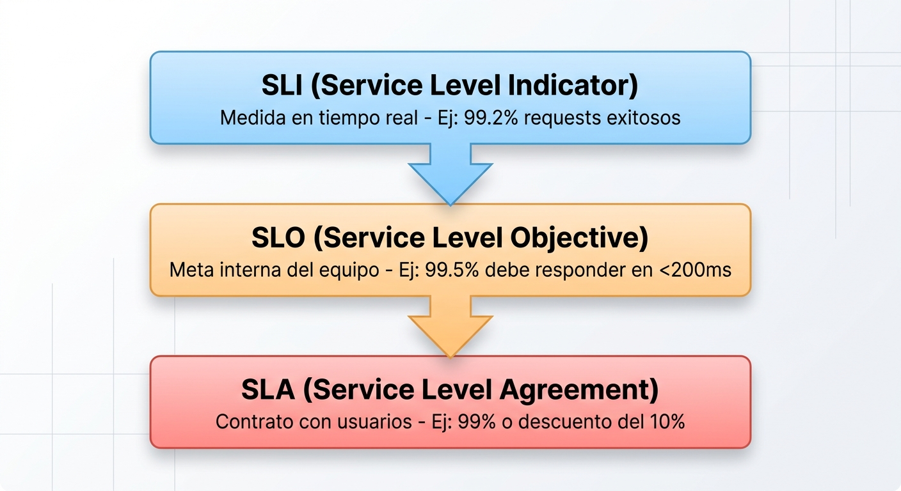
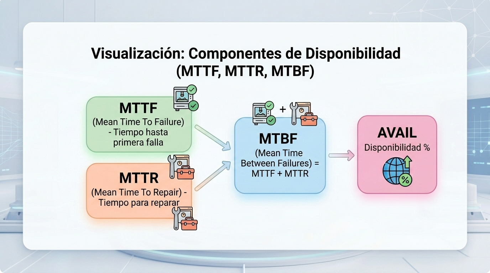
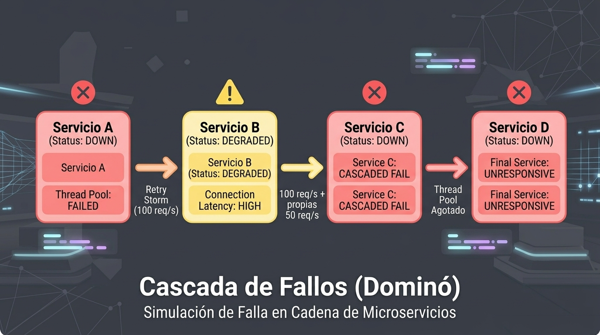

# 1.1 Fundamentos de Disponibilidad y Confiabilidad

Iniciamos la Unidad 1 estableciendo los cimientos teóricos y cuantitativos para entender por qué los sistemas fallan y cómo medimos su capacidad de mantenerse a flote antes de diseñar arquitecturas distribuidas.

## 1. Explicación conceptual

Cuando pasamos del desarrollo local en nuestra máquina a entornos productivos de escala masiva, la premisa fundamental cambia por completo: **todo lo que pueda fallar, fallará en algún momento**. En el paradigma _cloud-native_, la alta disponibilidad (_High Availability_ o HA) y la confiabilidad (_reliability_) no son propiedades accidentales del software, sino características arquitectónicas diseñadas explícitamente desde el primer día.

### Disponibilidad vs. confiabilidad

A menudo estos términos se usan como sinónimos, pero representan métricas distintas:

- **Disponibilidad (_availability_):** Es la proporción de tiempo que un sistema permanece funcional y accesible para responder a las peticiones de los usuarios. Se mide comúnmente en el porcentaje de "nueves" (ej. 99.9% o "tres nueves", lo que equivale a un máximo de ~8.76 horas de indisponibilidad al año).

- **Confiabilidad (_reliability_):** Es la probabilidad de que un sistema realice su función prevista de manera correcta y sin errores durante un período especificado bajo condiciones determinadas. Un sistema puede tener alta disponibilidad (responder siempre a las peticiones) pero baja confiabilidad (responder con un error `500 Internal Server Error`).

### Factores que afectan la disponibilidad

1. **Puntos únicos de fallo (_Single Points of Failure_ - SPOF):** Componentes individuales (un _load balancer_ no replicado, un único nodo de base de datos o un _switch_ de red) cuya falla provoca el colapso total del sistema.

2. **Saturación de recursos:** Agotamiento de CPU, memoria, sockets de red o _connection pools_ hacia la base de datos debido a picos inusuales de tráfico.

3. **Cascanueces de fallos o fallas en cascada (_cascading failures_):** Ocurre cuando la falla de un microservicio sobrecarga a los servicios vecinos que intentan reintentar peticiones descontroladamente (_retry storms_), provocando un efecto dominó.

4. **Despliegues y cambios operativos:** Errores humanos en la configuración, actualizaciones de código no probadas correctamente o falta de estrategias de _rollback_ automático.

### Principios de ingeniería de confiabilidad de sitios (SRE)

Pionera por Google, la disciplina de SRE (_Site Reliability Engineering_) aplica principios de ingeniería de software a la gestión de infraestructura y operaciones:

- **El abrazo al riesgo y los _error budgets_:** La disponibilidad del 100% no existe y intentar alcanzarla es prohibitivamente costoso e inhabilita la innovación. El _error budget_ (presupuesto de error) representa el margen permisible de fallas (100% - SLO). Mientras exista _error budget_, se pueden liberar características rápidamente; si se agota, se congelan los despliegues hasta estabilizar la plataforma.

- **Simplicidad y eliminación del _toil_:** Automatizar tareas repetitivas y manuales para enfocar la ingeniería en prevenir incidentes futuros.

- **Monitoreo orientado a la experiencia del usuario:** Monitorear desde la perspectiva del cliente (_user journey_) en lugar de simples métricas aisladas de servidor (como el uso de CPU).

### Métricas clave: SLI, SLO, SLA, MTTR, MTTF, MTBF

|**Métrica**|**Nombre completo**|**Descripción técnico-operativa**|
|---|---|---|
|**SLI**|_Service Level Indicator_|Medida cuantitativa en tiempo real del comportamiento de un servicio (ej. la latencia de respuesta o el porcentaje de peticiones exitosas `200 OK`).|
|**SLO**|_Service Level Objective_|La meta cuantitativa interna acordada por el equipo de ingeniería para un SLI (ej. "el 99.5% de las peticiones deben responder en menos de 200 ms durante 30 días").|
|**SLA**|_Service Level Agreement_|El contrato legal o compromiso comercial firmado con los usuarios finales. Define penalizaciones o desembolsos financieros si el SLO no se cumple. El SLA siempre es más permisivo que el SLO.|
|**MTTF**|_Mean Time to Failure_|Tiempo promedio que transcurre desde que un componente entra en operación hasta que sufre una falla irreparable. Aplica a componentes no reparables.|
|**MTTR**|_Mean Time to Repair_|Tiempo promedio requerido para diagnosticar, mitigar y resolver una falla una vez que se ha detectado. Reducir el MTTR es el objetivo primario en arquitecturas resilientes.|
|**MTBF**|_Mean Time Between Failures_|Tiempo promedio transcurrido entre dos fallas consecutivas en un sistema reparable ($\text{MTBF} = \text{MTTF} + \text{MTTR}$).|

$$\text{Disponibilidad} = \frac{\text{MTBF}}{\text{MTBF} + \text{MTTR}} \times 100$$

### Visualización: Relación entre SLI, SLO y SLA



### Visualización: Componentes de Disponibilidad



## 2. Analogía del mundo real

Imagina la cocina de un restaurante de alta cocina con una estrella Michelin durante la hora pico de un viernes.

- **SPOF (Punto único de fallo):** Hay un solo chef principal que supervisa la parrilla. Si se corta un dedo o se desmaya, toda la cocina se detiene por completo. Para evitar esto, se necesita un sistema con un _chef de respaldo_ (_active-passive_) o múltiples estaciones de parrilla funcionando simultáneamente (_active-active_).

- **SLI (_Service Level Indicator_):** Es el temporizador que mide cuántos minutos tarda cada platillo desde que se toma la orden hasta que llega a la mesa del cliente.

- **SLO (_Service Level Objective_):** El estándar de calidad que fijó el chef ejecutivo: _"El 95% de los platillos principales deben entregarse en menos de 18 minutos"_.

- **SLA (_Service Level Agreement_):** El compromiso del menú frente a los clientes: _"Si su comida tarda más de 35 minutos, el postre y la botella de vino van por cuenta de la casa"_.

- **MTTR (_Mean Time to Repair_):** Si a un cocinero se le quema una guarnición, ¿cuánto tiempo toma tirarla a la basura, limpiar el sartén y volver a preparar una guarnición nueva de reemplazo? Un tiempo de respuesta bajo mantiene al restaurante funcionando sin retrasos perceptibles.

- **MTTF (_Mean Time to Failure_):** Si el horno principal no se puede reparar y debe reemplazarse, ¿cuánto tiempo funciona en promedio desde que se instala hasta que falla definitivamente?

- **MTBF (_Mean Time Between Failures_):** Si el horno sí se puede reparar, ¿cuánto tiempo transcurre en promedio entre una avería y la siguiente, contando el tiempo de reparación y su regreso al servicio?

- **Error Budget:** Si el equipo sabe que puede fallar en el 5% de las órdenes (su SLO es 95%), tienen margen de maniobra durante la semana para probar nuevos platillos en el menú. Pero si acumulan demasiados clientes insatisfechos a principio de mes, cancelan las pruebas culinarias y se apegan estrictamente a los platillos tradicionales hasta recuperar el margen.

### Visualización: Cascada de Fallos (Dominó)



## 3. Desglose técnico paso a paso

Para afianzar cómo aterrizamos los fundamentos de confiabilidad en código Java utilizando el framework **Quarkus**, trabajaremos con el proyecto base `catalog-service` del laboratorio. El proyecto ya incluye un _health check_, patrones de tolerancia a fallos y endpoints para medir la disponibilidad sin depender todavía de una plataforma completa de observabilidad.

### Paso 1: Configurar la aplicación Quarkus

Desde el directorio `Unidad-1-ha-architecture/02-laboratorio/proyecto-base/catalog-service`, las dependencias principales del archivo `pom.xml` son:

```xml
<dependencies>
    <dependency>
        <groupId>io.quarkus</groupId>
        <artifactId>quarkus-rest-jackson</artifactId>
    </dependency>
    <dependency>
        <groupId>io.quarkus</groupId>
        <artifactId>quarkus-smallrye-health</artifactId>
    </dependency>
    <dependency>
        <groupId>io.quarkus</groupId>
        <artifactId>quarkus-smallrye-fault-tolerance</artifactId>
    </dependency>
</dependencies>
```

### Paso 2: Crear un indicador de disponibilidad personalizado (_Health Check_)

El proyecto contiene la clase `src/main/java/com/ecom/catalog/ReadinessHealthCheck.java`. Esta comprobación simula la conectividad del clúster de base de datos y devuelve `UP` el 95% de las veces, o `DOWN` el 5% restante.

El código central de la clase es:

```java
package com.ecom.catalog;

import org.eclipse.microprofile.health.HealthCheck;
import org.eclipse.microprofile.health.HealthCheckResponse;
import org.eclipse.microprofile.health.Readiness;
import jakarta.enterprise.context.ApplicationScoped;
import java.util.Random;

@Readiness
@ApplicationScoped
public class ReadinessHealthCheck implements HealthCheck {

    private final Random random = new Random();

    @Override
    public HealthCheckResponse call() {
        boolean isReady = checkDatabaseCluster();

        if (isReady) {
            return HealthCheckResponse.up("catalog-database-check");
        } else {
            return HealthCheckResponse.down("catalog-database-check");
        }
    }

    private boolean checkDatabaseCluster() {
        return random.nextInt(100) >= 5;
    }
}
```

### Paso 3: Simular solicitudes para medir disponibilidad básica

El endpoint real del proyecto es `/v1/products`, implementado en `src/main/java/com/ecom/catalog/CatalogResource.java`. Este endpoint simula una consulta al catálogo y aplica `Timeout`, `Retry`, `CircuitBreaker` y `Fallback`.

La configuración de resiliencia es:

```java
package com.ecom.catalog;

import org.eclipse.microprofile.faulttolerance.CircuitBreaker;
import org.eclipse.microprofile.faulttolerance.Fallback;
import org.eclipse.microprofile.faulttolerance.Retry;
import org.eclipse.microprofile.faulttolerance.Timeout;
import jakarta.ws.rs.GET;
import jakarta.ws.rs.Path;
import jakarta.ws.rs.Produces;
import jakarta.ws.rs.core.MediaType;
import jakarta.ws.rs.core.Response;
import java.util.Random;
import java.util.logging.Logger;

@Path("/v1/products")
public class CatalogResource {

    private static final Logger LOG = Logger.getLogger(CatalogResource.class.getName());
    private final Random random = new Random();

    @GET
    @Produces(MediaType.APPLICATION_JSON)
    @Timeout(800)
    @Retry(maxRetries = 2, delay = 150)
    @CircuitBreaker(requestVolumeThreshold = 4, failureRatio = 0.5, delay = 5000)
    @Fallback(fallbackMethod = "getCatalogFallback")
    public Response getProducts() throws InterruptedException {
        int chance = random.nextInt(10);

        if (chance < 2) {
            LOG.warning("Simulando latencia alta en consulta de catálogo...");
            Thread.sleep(1200);
        }

        if (chance >= 2 && chance < 5) {
            LOG.severe("Falla de conexión a la base de datos primaria.");
            throw new RuntimeException("Database connection timeout");
        }

        return Response.ok("{\"status\":\"SUCCESS\",\"data\":[\"Product A\",\"Product B\",\"Product C\"]}").build();
    }

    public Response getCatalogFallback() {
        return Response.ok("{\"status\":\"DEGRADED_CACHE\",\"data\":[\"Cached Product A\",\"Cached Product B\"]}").build();
    }
}
```

### Paso 4: Laboratorio guiado: observar disponibilidad y degradación

En esta práctica trabajarás con varias terminales para relacionar la solicitud del cliente, los _logs_ de Quarkus, el estado de salud y la respuesta entregada. No cierres ninguna terminal hasta terminar.

#### Terminal 1: iniciar el servicio y observar los _logs_

Desde la raíz del repositorio, inicia la aplicación:

```bash
cd Unidad-1-ha-architecture/02-laboratorio/proyecto-base/catalog-service
./mvnw quarkus:dev
```

Deja esta terminal visible. Cada mensaje permitirá relacionar lo que sucede internamente con lo que observarás en las otras terminales:

- `Catálogo retornado exitosamente desde la base de datos primaria.`: respuesta `SUCCESS`.
- `Simulando latencia alta en consulta de catálogo...`: escenario que puede activar `Timeout` y `Fallback`.
- `Falla de conexión a la base de datos primaria.`: fallo de la dependencia.
- `Fallback activado: Sirviendo datos desde la memoria caché local.`: respuesta `DEGRADED_CACHE`.

#### Terminal 2: comprobar los estados de salud

Ejecuta las comprobaciones del servicio:

```bash
curl -i http://localhost:8080/health
curl -i http://localhost:8080/ready
curl -i http://localhost:8080/live
```

`/health` muestra el estado general, `/ready` indica si el servicio está listo para recibir tráfico y `/live` indica si el proceso está vivo. Para observar la simulación de disponibilidad del 95% del _readiness check_, repite varias veces:

```bash
for i in {1..20}; do
    printf '%02d ' "$i"
    curl -s http://localhost:8080/ready
    echo
done
```

Busca respuestas `UP` y, eventualmente, `DOWN`. Un `DOWN` en `/ready` significa que Kubernetes debería retirar temporalmente el _Pod_ del tráfico; no significa necesariamente que el proceso haya muerto, porque `/live` puede continuar en `UP`.

#### Terminal 3: generar tráfico y ver la respuesta en tiempo real

Envía solicitudes al endpoint real. Cada línea muestra el cuerpo, el código HTTP y la latencia:

```bash
for i in {1..20}; do
    printf '%02d ' "$i"
    curl -sS -w ' | HTTP %{http_code} | tiempo %{time_total}s\n' http://localhost:8080/v1/products
done
```

Relaciona cada línea con los _logs_ de la Terminal 1:

- `SUCCESS` con el log de retorno desde la base de datos primaria.
- `DEGRADED_CACHE` con el log de `Fallback`.
- Una latencia cercana o superior a `0.8s` con el `Timeout` configurado en `800ms`.
- Una respuesta `200` con `DEGRADED_CACHE` confirma que hay disponibilidad técnica, pero calidad funcional degradada.

Los escenarios son aleatorios. Si no aparece `DEGRADED_CACHE`, repite este bloque; el código simula latencia alta en el 20% de los intentos y fallas de conexión en el 30%, antes de que `Retry`, `CircuitBreaker` y `Fallback` determinen la respuesta final.

#### Terminal 4: guardar y clasificar una muestra

Registra una muestra que incluya el cuerpo JSON, el código HTTP y la latencia:

```bash
for i in {1..40}; do
    response_file=$(mktemp)
    metadata=$(curl -sS -o "$response_file" -w "%{http_code} %{time_total}" http://localhost:8080/v1/products)
    printf '%02d %s %s\n' "$i" "$metadata" "$(cat "$response_file")"
    rm -f "$response_file"
done | tee availability-sample.txt
```

Analiza la muestra:

```bash
PRIMARY=$(grep -c '"status":"SUCCESS"' availability-sample.txt || true)
DEGRADED=$(grep -c '"status":"DEGRADED_CACHE"' availability-sample.txt || true)
HTTP_200=$(grep -cE '^[0-9]+ 200 ' availability-sample.txt || true)
HTTP_ERRORS=$(grep -cEv '^[0-9]+ 200 ' availability-sample.txt || true)
TOTAL=$(wc -l < availability-sample.txt | tr -d ' ')

echo "Solicitudes totales: $TOTAL"
echo "Respuestas SUCCESS: $PRIMARY"
echo "Respuestas DEGRADED_CACHE: $DEGRADED"
echo "Respuestas HTTP 200: $HTTP_200"
echo "Respuestas HTTP distintas de 200: $HTTP_ERRORS"
echo "SLI de disponibilidad: $(echo "scale=4; $HTTP_200 / $TOTAL" | bc)"
```

#### Terminal 1 y Terminal 3: observar el circuito y la recuperación

Genera más tráfico desde la Terminal 3 y observa simultáneamente la Terminal 1. Cuando se alcance el umbral del `CircuitBreaker`, algunas solicitudes pueden ir directamente al `Fallback` durante aproximadamente cinco segundos. Después de ese intervalo, continúa enviando solicitudes y observa si vuelven a aparecer respuestas `SUCCESS` cuando la simulación de la dependencia no falla.

Finalmente, interpreta los resultados: `SUCCESS` representa una respuesta normal; `DEGRADED_CACHE` representa continuidad del servicio con datos degradados; HTTP distinto de `200` representa una indisponibilidad del endpoint; y `/live` en `UP` junto con `/ready` en `DOWN` representa un proceso vivo que no debe recibir tráfico temporalmente.

## 4. Reto de ingeniería o pregunta de reflexión

**El escenario:**

Un servicio de autenticación crítico procesa $1,000,000$ de solicitudes por día. El equipo de negocio definió un **SLO de disponibilidad del 99.9%** mensual para este servicio.

Durante una actualización de mantenimiento a mitad de mes, una mala configuración en el _connection pool_ causó un periodo de indisponibilidad total (_downtime_) que duró exactamente **45 minutos**.

**Para debatir en clase:**

1. ¿El equipo agotó el _error budget_ correspondiente a ese mes de 30 días? Muestra el cálculo matemático que respalda tu respuesta.

2. Si el tiempo de detección de la falla por las alertas (_Time to Detect_) fue de 5 minutos, ¿qué acciones de diseño de infraestructura o instrumentación de métricas implementarías para reducir el **MTTR** en el siguiente evento sin tocar el código fuente de Java?
