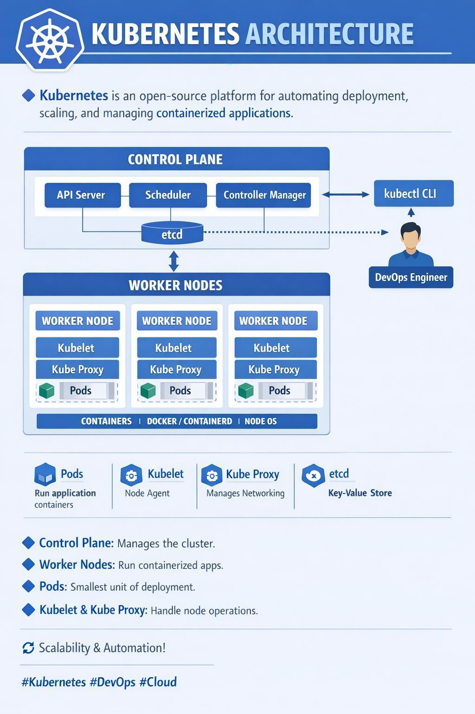

# 2.1 Arquitectura y componentes clave

En la sesión anterior analizamos cómo estructurar la infraestructura _multi-AZ_ y tolerante a fallos en la nube, y ahora en esta sesión llevaremos ese conocimiento a la práctica al explorar la arquitectura interna y componentes clave de Kubernetes.

### 1. Explicación conceptual

Kubernetes funciona mediante una arquitectura distribuida basada en un modelo de **estado deseado** (_declarative state management_). En lugar de indicarle al sistema cada comando paso a paso, declaramos cómo queremos que se vea el clúster (por ejemplo, "mantén 3 réplicas del microservicio en Quarkus") y el orquestador se encarga continuamente de reconciliar el estado actual con el estado deseado.

Para lograr esto, la arquitectura se divide limpiamente en dos planos de responsabilidad:

#### Plano de Control (_Control Plane_)

Es el cerebro del clúster. Toma las decisiones de orquestación, detecta eventos y reacciona ante fallos de infraestructura:

- **kube-apiserver:** Es el único componente del clúster con el que interactuamos directamente (vía `kubectl` o API REST). Sirve como la puerta de entrada, valida y configura datos para los objetos de la API (`Pods`, `Services`, `Deployments`). Es totalmente _stateless_.

- **etcd:** La única fuente de la verdad (_Single Source of Truth_). Es una base de datos clave-valor distribuida, consistente y altamente disponible (usa el algoritmo de consenso Raft). Guarda todo el estado declarativo del clúster. Ningún componente habla con `etcd` directamente, excepto el `kube-apiserver`.

- **kube-scheduler:** El estratega de asignación. Busca _Pods_ recién creados que no tienen un nodo asignado y elige el mejor nodo de trabajo (_Worker Node_) para ejecutarlos, basándose en requerimientos de CPU/memoria, etiquetas (`labels`), afinidad (_affinity_) y restricciones de zona (_topology spread constraints_).

- **kube-controller-manager:** El motor de la reconciliación. Ejecuta múltiples procesos controladores en segundo plano (como `DeploymentController`, `NodeController` o `ReplicaSetController`). Compara constantemente el estado real del clúster contra el estado deseado almacenado en `etcd`.

#### Plano de Trabajo (_Worker Nodes_)

Son las máquinas (físicas o virtuales) donde se ejecutan realmente nuestras aplicaciones dentro de contenedores:

- **kubelet:** El agente maestro en cada nodo. Se comunica directamente con el `kube-apiserver`, recibe las especificaciones de los _Pods_ (`PodSpecs`) que le fueron asignados a su nodo y le indica al _container runtime_ que los cree, inicie o destruya. También monitorea la salud de los contenedores.

- **kube-proxy:** El administrador de red del nodo. Mantiene las reglas de red en las máquinas (usando `iptables` o `ipvs`) para permitir la comunicación por red hacia y entre tus _Pods_, implementando la abstracción de los objetos `Service`.

- **Container Runtime:** El motor subyacente que ejecuta los contenedores (como `containerd` o `CRI-O`). Recibe las órdenes del `kubelet` a través de la interfaz estándar `CRI` (_Container Runtime Interface_).

#### Tabla comparativa: Componentes del Control Plane vs. Worker Nodes

| Componente | Ubicación | Responsabilidad | Rol Análogo |
|---|---|---|---|
| **kube-apiserver** | Control Plane | Puerta de entrada, valida manifiestos YAML | Capitán de barco |
| **etcd** | Control Plane | Base de datos, fuente única de la verdad | Bitácora oficial |
| **kube-scheduler** | Control Plane | Asigna Pods a nodos según recursos | Asignador de camarotes |
| **kube-controller-manager** | Control Plane | Reconciliación: estado actual = estado deseado | Supervisores de turno |
| **kubelet** | Worker Node | Ejecuta contenedores en el nodo | Mayordomo de cubierta |
| **kube-proxy** | Worker Node | Gestiona reglas de red y tráfico | Sistema de pasillos/elevadores |
| **Container Runtime** | Worker Node | Descarga y ejecuta contenedores | Personal de limpieza |

#### Modelo de Red Plana (_Flat Network Model_)

Kubernetes impone un modelo de red fundamental conocido como "IP por Pod" (_IP-per-Pod model_):

1. Todos los _Pods_ pueden comunicarse entre sí en un clúster sin usar NAT (_Network Address Translation_), independientemente de en qué _Worker Node_ residan.

2. Los agentes de un nodo (como el `kubelet`) pueden comunicarse con todos los _Pods_ de ese mismo nodo.

3. Se requiere un complemento CNI (_Container Network Interface_ como Calico, Cilium o Flannel) para implementar este modelo y aplicar políticas de red (_NetworkPolicies_) que aíslen el tráfico entre espacios de nombres (_namespaces_).

### 2. Analogía del mundo real

Imagina la operación diaria de un crucero internacional de lujo:

- **El Control Plane es el puente de mando:**

    - **kube-apiserver (El Capitán / Recepción central):** Cualquier solicitud de un pasajero o tripulante entra por aquí. Nadie toma decisiones sin registrar el pedido en la recepción.

    - **etcd (El libro oficial de bitácora):** Un registro oficial bajo llave donde se anota cada detalle: qué pasajeros están a bordo, qué camarotes están ocupados y qué emergencias se han reportado. Si no está en la bitácora, no existe.

    - **kube-scheduler (El asignador de camarotes):** Evalúa el tamaño del grupo familiar, si pidieron vista al mar o acceso a sillas de ruedas, y decide en qué cubierta y camarote específico acomodarlos.

    - **kube-controller-manager (Los supervisores de turno):** Si el supervisor nota que el plan dice "debe haber 4 salvavidas en la piscina" y solo ve 3, ordena traer uno nuevo inmediatamente para cumplir la norma.

- **Los Worker Nodes son las cubiertas de servicio:**

    - **kubelet (El mayordomo jefe de cubierta):** Recibe las órdenes del puente de mando ("prepara el camarote 302 para dos personas") y se asegura de que el personal de limpieza abra el cuarto y ponga las camas necesarias.

    - **Container Runtime (El personal de limpieza y mantenimiento):** Quienes realmente arman las camas, encienden el aire acondicionado y abren los cuartos (crean los contenedores).

    - **kube-proxy (El sistema de pasillos y elevadores con señalética):** Garantiza que si un pasajero pide servicio al cuarto desde la cocina, los platillos lleguen al camarote correcto sin importar en qué nivel esté la cocina o el cuarto.

### Visualización: Arquitectura Control Plane vs. Worker Nodes

**Características destacadas:**

- ✅ **Control Plane centralizado:** Toma todas las decisiones de orquestación
- ✅ **Worker Nodes distribuidos:** Ejecutan contenedores según órdenes del Control Plane
- ✅ **Modelo declarativo:** Declaras deseo (YAML) → Control Plane reconcilia
- ✅ **Red plana:** Todos los Pods se alcanzan directamente (10.244.x.x) sin NAT
- ✅ **kubelet:** Agente en cada nodo que ejecuta los Pods
- ✅ **kube-proxy:** Gestiona reglas de red (iptables/ipvs)

### 3. Laboratorio

Para completar esta parte, sigue el [Laboratorio de la clase 2.1](../02-laboratorio/laboratorio-clase-2-1.md). Allí encontrarás todos los pasos, código y procedimientos necesarios para inspeccionar los componentes del Control Plane, rastrear el ciclo de vida de una solicitud, validar la red plana de Pods y realizar pruebas de conectividad.

### 4. Reto de ingeniería o pregunta de reflexión

**El escenario:** Durante un mantenimiento programado, la base de datos **`etcd` sufre una pérdida total de quorum y queda inaccesible durante 15 minutos**. Sin embargo, todos los _Worker Nodes_ y sus interfaces de red siguen funcionando normalmente.

**Para debatir en clase:**

1. Durante los 15 minutos que `etcd` estuvo caído, ¿qué ocurre con las aplicaciones y microservicios en Quarkus que ya estaban corriendo en los _Worker Nodes_? ¿Siguen recibiendo y respondiendo peticiones de los usuarios finales a través de `kube-proxy`?

2. Si durante esa misma ventana de falla un _Pod_ en un _Worker Node_ colapsa por un error de memoria (`OOMKilled`), ¿qué capacidad tiene el clúster de autorecuperarse y crear un reemplazo? Explica qué componente se ve imposibilitado de actuar y por qué.

