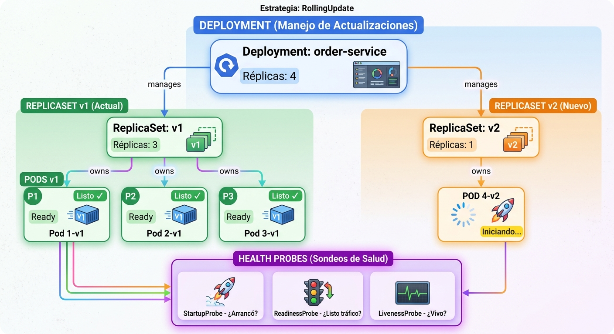
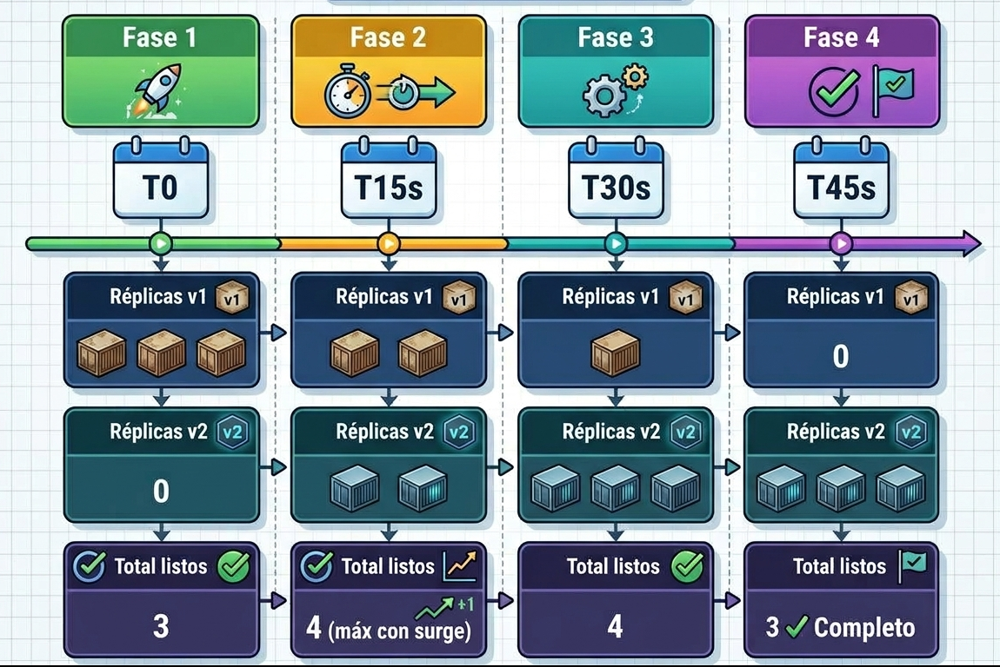

# 2.2 Objetos de despliegue para alta disponibilidad

En la sesión anterior analizamos cómo interactúan el _Control Plane_ y los _Worker Nodes_ en Kubernetes, y ahora en esta sesión llevaremos ese conocimiento a la práctica al explorar los objetos de despliegue como _Deployments_, _ReplicaSets_ y _StatefulSets_ para garantizar alta disponibilidad.

## 1. Explicación conceptual

Garantizar alta disponibilidad (_High Availability_) en producción no consiste únicamente en crear contenedores, sino en gestionar de forma inteligente su ciclo de vida, su estrategia de actualización y la forma en que el orquestador detecta cuando un proceso entra en un estado no saludable.

### Objetos de workload para alta disponibilidad

Kubernetes proporciona distintas abstracciones de nivel superior según la naturaleza de la carga de trabajo:

| Objeto | Caso de Uso | Estrategia de Actualización | Manejo de Identidad | Almacenamiento Persistente |
|---|---|---|---|---|
| **ReplicaSet** | Aplicaciones simples sin cambios frecuentes | No tiene (bajo nivel) | Pods anónimos e intercambiables | No (por defecto) |
| **Deployment** | Microservicios _stateless_ (Quarkus, Node.js, Go) | RollingUpdate / Recreate | Pods anónimos e intercambiables | No (por defecto) |
| **StatefulSet** | Bases de datos, brokers (PostgreSQL, Kafka) | Ordenado y controlado | Identidades únicas (`pod-0`, `pod-1`) | Sí (vinculado a PVC) |

**Detalles por objeto:**

- **ReplicaSet:** Garantiza que un número específico de réplicas exactas de un _Pod_ idéntico estén ejecutándose en todo momento. Si un _Pod_ muere, el `ReplicaSetController` instancia uno nuevo para mantener la cantidad declarada.

- **Deployment:** Es la abstracción de más alto nivel para aplicaciones _stateless_ (sin estado), como nuestros microservicios en Quarkus. Administra declarativamente los _ReplicaSets_ subyacentes y habilita actualizaciones de versión con reversión automática (_rollbacks_).

- **StatefulSet:** Diseñado para cargas de trabajo _stateful_ (con estado), como bases de datos (PostgreSQL, MySQL) o brokers de mensajería. Asigna una identidad de red única y persistente a cada _Pod_ (`pod-0`, `pod-1`), realiza despliegues e incrementos ordenados y vincula almacenamiento de forma persistente a cada réplica específica.

### Estrategias de actualización: Zero-downtime

Para actualizar la versión de nuestra aplicación en un `Deployment`, contamos con dos estrategias principales:

1. **Recreate:** Elimina de golpe todos los _Pods_ existentes antes de crear los nuevos. Produce un tiempo de inactividad (_downtime_) inevitable, pero es útil si no se pueden ejecutar dos versiones distintas del código simultáneamente por restricciones de esquema en la base de datos.

2. **RollingUpdate (Predeterminada):** Reemplaza de forma gradual y progresiva los _Pods_ antiguos por _Pods_ con la nueva versión. Controla el ritmo de actualización mediante dos parámetros clave:

    - `maxSurge`: Número o porcentaje máximo de _Pods_ que pueden crearse por encima del número deseado durante la actualización.

    - `maxUnavailable`: Número o porcentaje máximo de _Pods_ que pueden no estar disponibles durante el proceso.

### Probes de salud (Health Probes)

Para que la autocuración (_self-healing_) funcione, Kubernetes necesita verificar periódicamente el estado interno de nuestros contenedores:

- **StartupProbe:** Verifica si la aplicación ha arrancado por completo. Desactiva temporalmente los otros dos _probes_ para dar tiempo suficiente a aplicaciones con tiempos de inicio prolongados (como entornos Java pesados).

- **ReadinessProbe:** Determina si el _Pod_ está listo para recibir tráfico de red. Si falla, Kubernetes no destruye el contenedor, sino que lo remueve de la lista de _Endpoints_ del _Service_ para evitar que los usuarios reciban errores HTTP 500.

- **LivenessProbe:** Determina si la aplicación está viva. Si falla repetidamente (según el `failureThreshold`), el `kubelet` reinicia inmediatamente el contenedor para recuperarlo de bloqueos (_deadlocks_) o estados irrecuperables.

## 2. Analogía del mundo real

Imagina la gestión de un equipo de corredores de relevos en un maratón de alto rendimiento:

- **Deployment y ReplicaSet es el director del equipo:** Su única instrucción es: "Siempre debe haber 4 corredores activos en la pista". Si uno se lesiona o tropieza (caída de un nodo), el director manda un corredor de reemplazo a la pista inmediatamente sin detener la carrera.

- **RollingUpdate vs. Recreate:**

    - **Recreate:** El director le pide a los 4 corredores que se salgan de la pista al mismo tiempo, la pista queda vacía por un minuto (tiempo de inactividad) y luego entran los 4 nuevos corredores con la nueva camiseta.

    - **RollingUpdate:** Un corredor nuevo entra a la pista mientras uno de los viejos sigue corriendo a la par. Cuando el nuevo agarra el ritmo (pasa el _readiness probe_), el viejo se sale. La carrera nunca se detiene para los espectadores.

- **Probes de salud:**
    
    - **StartupProbe (Examen médico inicial):** El médico del equipo valida que el atleta ya se amarró los tenis y estiró antes de meterlo a la pista.

    - **ReadinessProbe (Bandera verde/roja de relevo):** El atleta sigue corriendo, pero si se le cae el testimonio de relevo, el juez le muestra bandera roja y le prohíbe recibir pases hasta que lo recoja (se le quita tráfico del _load balancer_).

    - **LivenessProbe (Chequeo de pulso en carrera):** Si el médico detecta que el atleta sufrió un desmayo en plena carrera, ordena sacarlo en camilla y reiniciar la posición con un corredor fresco.

## Visualización: Ciclo de Vida de Deployment → ReplicaSet → Pods

**Durante Rolling Update (v1 → v2):**

**Conceptos clave:**

- **maxSurge: 1** → Permite crear máximo 5 Pods durante la actualización (4 + 1)
- **maxUnavailable: 0** → Garantiza que siempre existan 4 Pods ready recibiendo tráfico
- **Resultado:** ✅ **Zero-downtime deployment** - los usuarios nunca notan la actualización

**Health Probes en acción:**

| Probe | Función | Comportamiento |
|-------|---------|-----------------|
| **StartupProbe** | Valida arranque de JVM | Espera hasta 60s (20 intentos × 3s) |
| **ReadinessProbe** | ¿Listo para tráfico? | Si falla: remueve del Service load balancer |
| **LivenessProbe** | ¿Proceso vivo? | Si falla: reinicia el contenedor |

## 3. Laboratorio

Para completar esta parte, sigue el [Laboratorio de la clase 2.2](../02-laboratorio/laboratorio-clase-2-2.md). Allí encontrarás todos los pasos, código y procedimientos necesarios para crear Deployments con RollingUpdate, configurar los tres tipos de health probes, desplegar manifiestos YAML y ejecutar actualizaciones sin downtime.

## 4. Reto de ingeniería o pregunta de reflexión

**El escenario:** Un equipo de desarrollo desplegó un microservicio crítico en Quarkus con `maxUnavailable: 50%` y sin configurar ningún `readinessProbe` en el manifiesto YAML del `Deployment`.

Durante un despliegue en hora pico, la nueva imagen del microservicio contenía un error en la capa de inicialización de la base de datos que hacía que el proceso Java tardara 45 segundos en levantar su pool de conexiones.

**Para debatir en clase:**

1. Dado que no hay `readinessProbe` configurado, ¿en qué momento exacto considera Kubernetes que los nuevos _Pods_ están listos para recibir tráfico y qué porcentaje de peticiones de los usuarios reales fallará con error de conexión durante esos 45 segundos?

2. Si además configuramos un `livenessProbe` agresivo con `initialDelaySeconds: 5` y `periodSeconds: 2` sin incluir un `startupProbe`, ¿por qué la aplicación entrará en un bucle infinito de reinicios (_CrashLoopBackOff_) aunque el código no tenga ningún _bug_ sintáctico?
